# Employee Management System

A Git and GitHub assignment demonstrating repo creation, version control, branching, merging, remote repo management, and merge conflict resolution.

---

## Features

- Employee Registration
- Employee Dashboard
- Git Branching Workflow
- Merge Conflict Resolution

---

## Branch Structure

```
main
├── feature/employee-registration
├── feature/employee-dashboard
├── feature/login
└── feature/dashboard-conflict
```

---

## Screenshots

### Commit History
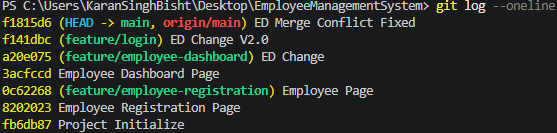

### All Branches
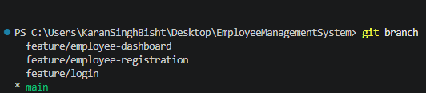

### Successful Merge
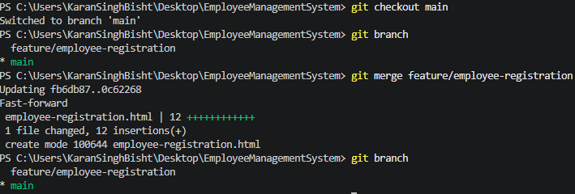

### Merge Conflict Resolution
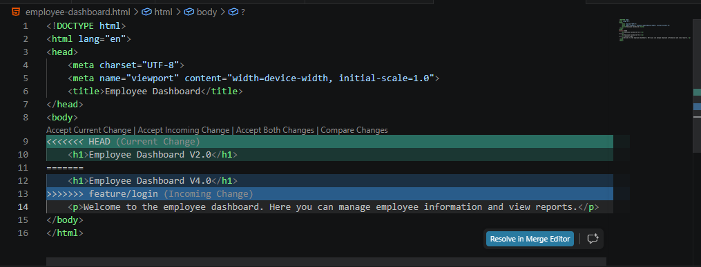

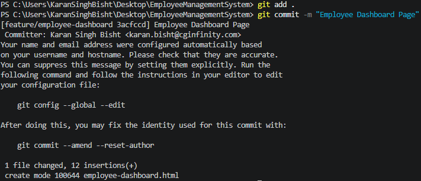

---

## Task-wise Screenshots

### Task 3 — Initialize Repository
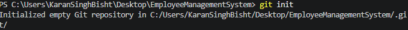


### Task 4 — First Commit
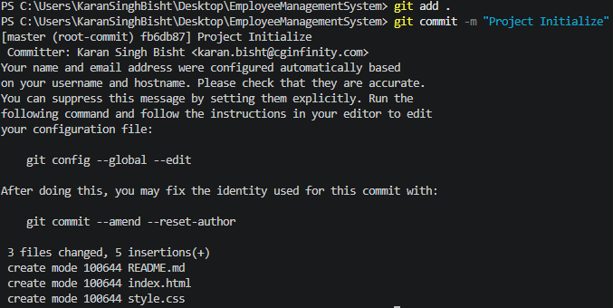

### Task 5 — View Log


### Task 8 — View Diff
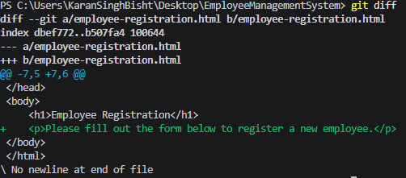

### Task 9 — Merge
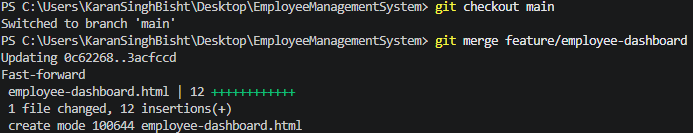

### Task 13 — Pull from Remote
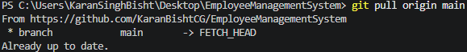

### Task 14 — Merge


### Task 15 — All Branches


### Task 16 — Merge & Push
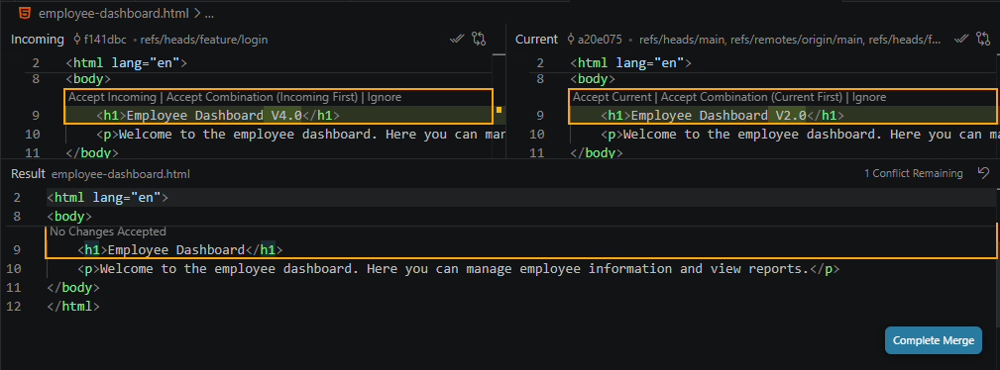
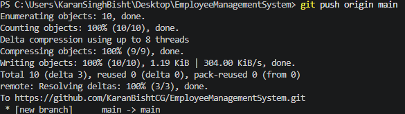

---

## Branching Strategy

A feature-based branching strategy suitable for a team of multiple developers.

### Main Branches

| Branch | Purpose |
|--------|---------|
| `main` | Stable, production-ready code |
| `develop` | Integration branch where completed features are merged before release |

### Supporting Branches

- **`feature/*`** — Created for new features.
  - e.g. `feature/employee-registration`, `feature/employee-dashboard`
- **`bugfix/*`** — Used to fix defects found during development.
  - e.g. `bugfix/login-validation`
- **`release/*`** — Created when preparing a production release.
  - e.g. `release/v1.0`

### Workflow

1. Developers create `feature` branches from `develop`.
2. Features are developed and committed independently.
3. Completed features are merged back to `develop`.
4. Bugfixes are handled through dedicated `bugfix` branches.
5. Release branches are created from `develop` for final testing.
6. Stable releases are merged into `main`.

### Benefits

- Supports parallel development by multiple developers.
- Keeps production code stable.
- Simplifies bug fixing and feature tracking.
- Reduces merge conflicts through isolated development.
